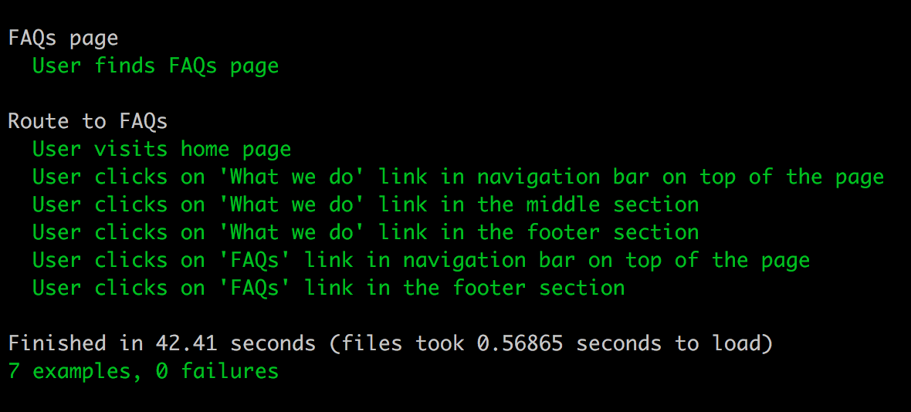

# Assertion

Write a piece of code to validate the assertion, any tool can be used but the suggestion is to go with Capybara/Ruby.

```
As a user when I go to https://doctorcareanywhere.com/
And click on “What we do”
And click on FAQs
Then I see FAQs page
```  

## Installation

1. Clone this repo  
``` git clone git@github.com:lcbeh/assertion.git```  

2. Access the folder  
``` cd assertion ```

3. Install dependencies  
``` bundle install```  

## Test

To run tests:  
```rspec ```


